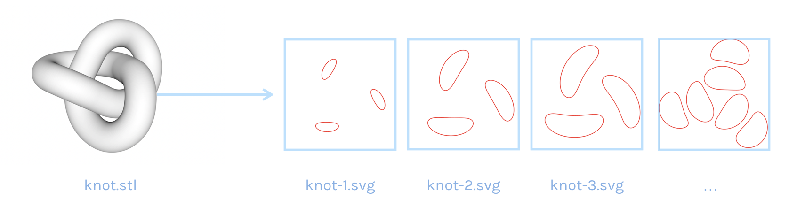

# STL slicing for 3D printing

*First year python project at Ensimag - Grenoble INP - 2016*



## Usage

```sh
usage: slicing.py [-h] [-s SLICES] file

Slicing 3D STL files. The slices are saved in the "tranches" directory

positional arguments:
  file                  Name of the stl file. Must be in the same directory as
                        the python programm.


optional arguments:
  -h, --help            show this help message and exit
  -s SLICES, --slices SLICES
                        Number of slices (equals 4 by default)
```

### Use examples

```sh
./slicing.py knot.stl
./slicing.py -s 20 knot.stl
./slicing.py knot.stl -s 20
./slicing.py --slices 20 Tux_printable.stl
./slicing.py -h
```
